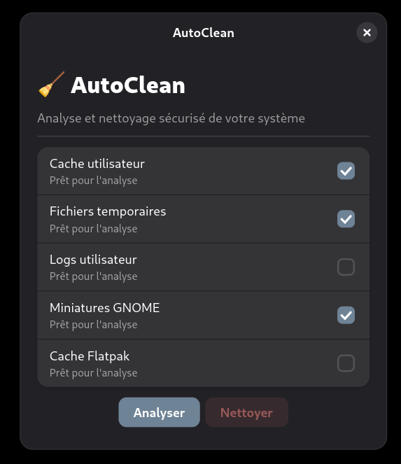

# 🧹 AutoClean

Application de nettoyage simple et moderne pour **Linux GNOME**<br/>
Basée sur **GTK 4** et **libadwaita**

---

## 📸 Aperçu



---

## ✨ Fonctionnalités

* ✔️ Analyse de fichiers inutiles
* ✔️ Nettoyage sécurisé
* ✔️ Confirmation avant suppression du dossier Téléchargements
* ✔️ Sélection des catégories à nettoyer
* ✔️ Indication du nombre de fichiers et taille totale
* ✔️ Mode clair / sombre / automatique / OLED (*Nouveau*)

Catégories analysées :

* cache utilisateur (`~/.cache`)
* fichiers temporaires (`/tmp`)
* miniatures GNOME
* logs utilisateur
* cache Flatpak
* Téléchargements (avec confirmation)

---

## 🚀 Installation

### 📦 Via paquet `.deb`
[👉 Télécharger ici](https://github.com/Itm0zLegends/AutoClean/releases/download/1.1.0/autoclean_1.1.0_amd64.deb)
```bash
sudo dpkg -i autoclean_1.1.0_amd64.deb
sudo apt -f install
```

---

## ⚠️ Avertissements

* ✖️ certaines suppressions sont **définitives**
* ✔️ confirmation avant suppression des Téléchargements
* ❗ utilisez avec précaution

---

## 🧑‍💻 Auteur

**CrowDEV**
🌐 [crowdev.fr](https://itm0zlegends.github.io/CrowDev/)
